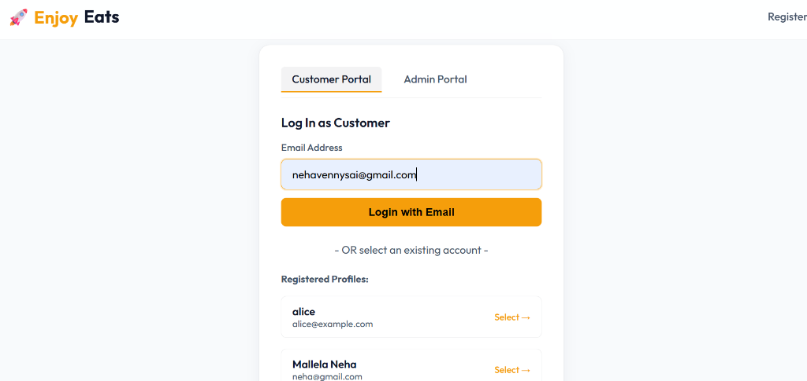
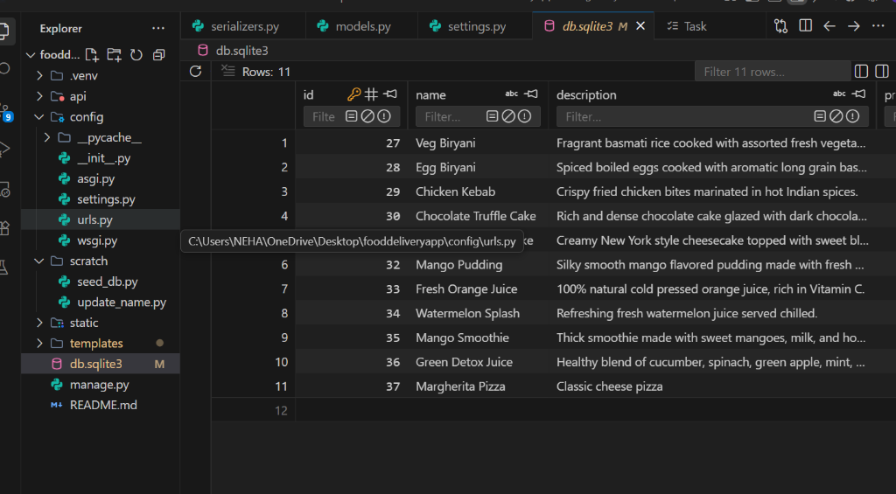
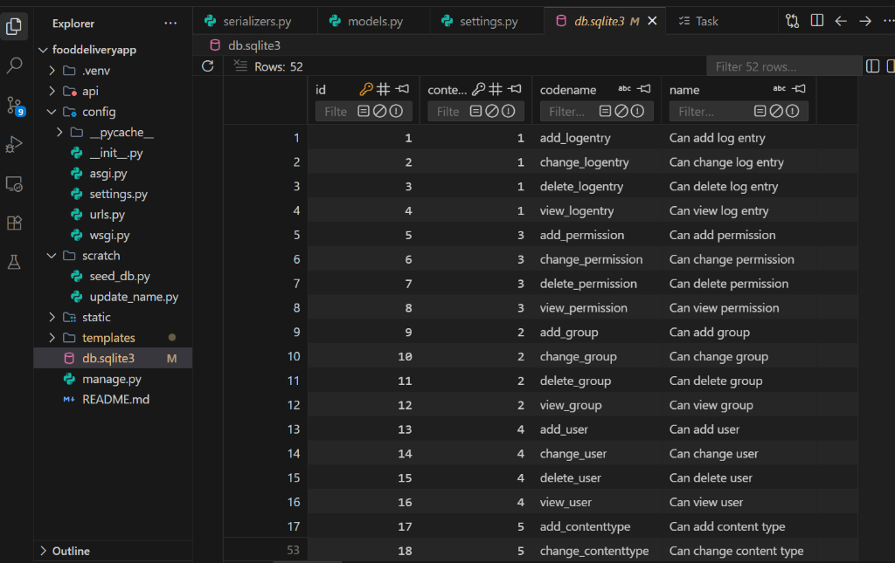
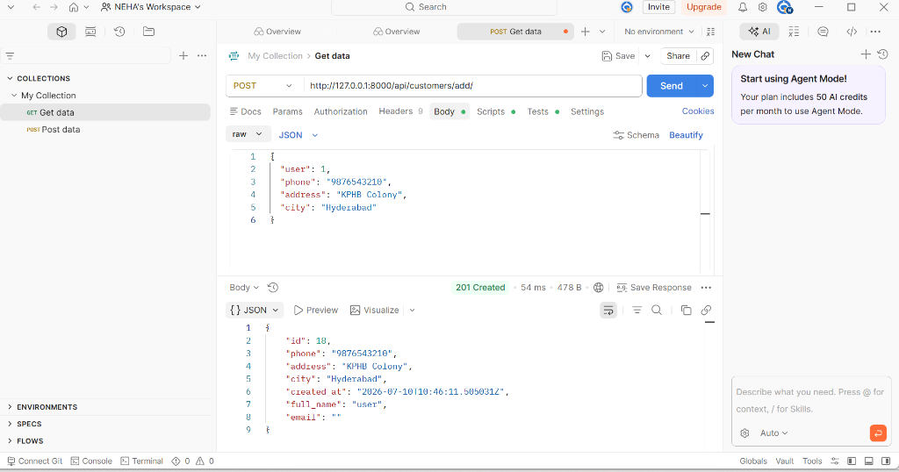
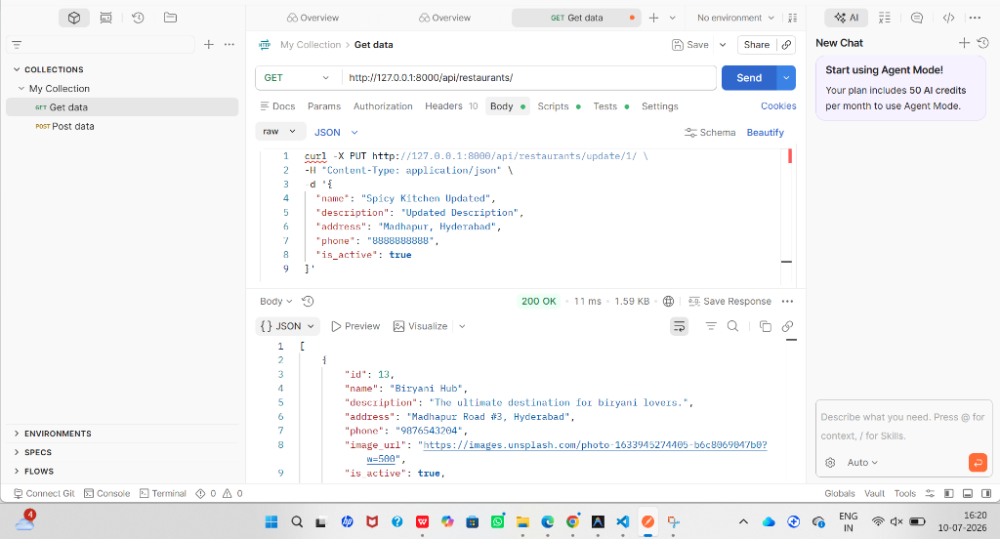

# 🚀 Enjoy Eats - Premium Food Delivery Web Application

Welcome to **Enjoy Eats**, a modern, responsive full-stack food delivery web application built using Django, Django REST Framework (DRF), and SQLite, styled with a premium vanilla CSS light-mode theme.

---

## 📸 Screenshots & Visual Demonstrations

Here is a neatly arranged overview of the application's user interface, database tables, and API testing logs.

### 🔐 1. Customer Portal Login UI
This screenshot showcases the clean, light-themed login portal featuring quick account selectors for registered customer profiles like **NEHA**.

---

### 📂 2. Database Schema (SQLite)

#### 🍔 Food Catalogue Table (`api_food`)
A snapshot of the seeded menu items database, displaying various main course biryanis, fresh juices, pizzas, and desserts along with pricing details.

#### 🔑 Auth Permissions Table (`auth_permission`)
A snapshot of the internal Django authentication permission schema configuration.

---

### 📡 3. REST API Endpoints Testing

#### 👤 POST /api/customers/add/
Demonstration of adding a customer using a JSON payload via an HTTP client, returning `201 Created` with default user profile values.

#### 🏪 GET /api/restaurants/
Testing the restaurant retrieval endpoint returning `200 OK` with restaurant details and banner image URLs.

